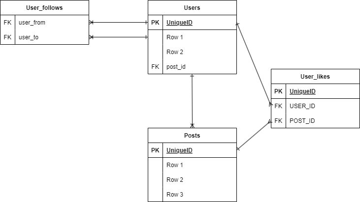

# course-5-nodejs-microservices-redis

This repository contains the materials for the "curso-nodejs-microservices", with microservices, authentication and redis.

## Overview

This course provides in-depth knowledge and hands-on experience with building RESTful APIs using Node.js and Express.js. Learning how microservices work and how to implement them using Node.js and Express.js. You will also learn how to use Redis as a cache to improve the performance of your Node.js applications. You will also learn how to implement authentication and authorization using JSON Web Tokens (JWT). Finally, you will learn how to deploy your Node.js applications to production. The project use a MySQL database to store data.

The project has a docker-compose file to run the mysql database and the phpmyadmin interface.

Microservices are a popular architectural style for building applications that are resilient, highly scalable, independently deployable, and able to evolve quickly. In this course, you will learn how to implement microservices using Node.js and Express.js. You will also learn how to deploy your microservices using Docker containers. You will also learn how to use Redis as a cache to improve the performance of your Node.js applications. You will also learn how to implement authentication and authorization using JSON Web Tokens (JWT). Finally, you will learn how to deploy your Node.js applications to production.

## Table of Contents

- [course-5-nodejs-microservices-redis](#course-5-nodejs-microservices-redis)
  - [Overview](#overview)
  - [Table of Contents](#table-of-contents)
  - [Installation](#installation)
  - [Api Endpoints](#api-endpoints)
  - [Built With](#built-with)
  - [Vercel Deploy](#vercel-deploy)
  - [Contributing](#contributing)
  - [License](#license)


## Installation

1. Clone this repository: `git clone https://github.com/AndresDiagoM/curso-nodejs-microservicios`
2. Navigate to the project folder: `cd curso-nodejs-microservicios`
3. Install the dependencies: `npm install`
4. Start the server: `npm start`
5. Open your browser and go to http://localhost:3000

## Usage

This is a microservices project, so you need to run these services in different terminals. The services are:

| Service                | Command               |
|------------------------|-----------------------|
| Users and Auth service | `npm run start`       |
| MySQL service          | `npm run mysql`       |
| Redis service          | `npm run redis`       |
| Posts service          | `npm run posts`       |
| PostgreSQL service     | `npm run postgres`    |

You can also run the services with the command `npx nodemon .\api\modules\cache\index-cache.js` to run the cache service.

Then, visit http://localhost:PORT in your browser or API tool.

Star Docker container:

  ```bash
  docker-compose up
  ```

If you want to star the phpmyadmin interface for the database, you can do it in the following way:

  ```bash
  docker-compose up -d phpmyadmin
  ```

### Using PM2 to run the microservices

You can use PM2 to run the microservices, you can install it with the following command:

  ```bash
  npm install pm2 -g
  ```

To run a service with PM2, you need to create an ecosystem file, you can create it with the following command:

  ```bash
  pm2 start .\postgres\index-postgres.js
  pm2 start .\mysql\index-mysql.js
  pm2 start .\posts\index-posts.js
  ```

Then, you can run the services with the following command:

  ```bash
  pm2 start ecosystem.config.js
  ```

## VERCEL DEPLOY

The project is deployed in Vercel, you can see it in the following link:

[curso-nodejs-microservicios.vercel.app](https://curso-nodejs-microservicios.vercel.app)

<details><summary>Vercel Configuration</summary>

  The `vercel.json` file is used to configure the deployment settings for your project on Vercel. Below is an explanation of each section in the `vercel.json` file:

  ### Environment Variables
  The `env` section specifies environment variables that will be available to your application during runtime. These variables are used to configure the connection to your PostgreSQL database.

  ```json
  {
      "env": {
          "POSTGRES_HOST": "bubble.db.elephantsql.com",
          "POSTGRES_USER": "jsnbqosq",
          "POSTGRES_PASSWORD": "wLmnaIEtmoml0jRXyamlDKH9_itLisSe",
          "POSTGRES_DATABASE": "jsnbqosq"
      }
  }
  ```

  ### Builds
  The `builds` section defines the build configuration for your project. Each entry specifies a source file and the builder to use. In this case, the `@vercel/node` builder is used for Node.js files.

  ```json
  {
      "builds": [
          {
              "src": "api/index.js",
              "use": "@vercel/node"
          },
          {
              "src": "api/post/index-post.js",
              "use": "@vercel/node"
          }
      ]
  }
  ```

  ### Routes

  The `routes` section defines custom routing rules for your application. Each route specifies a source pattern and a destination file. This allows you to map incoming requests to specific files in your project.

  ```json
  {
      "routes": [
          {
              "src": "/api/auth(.*)",
              "dest": "/api/index.js"
          },
          {
              "src": "/api/user(.*)",
              "dest": "/api/index.js"
          },
          {
              "src": "/api/docs(.*)",
              "dest": "/api/index.js"
          },
          {
              "src": "/api/post(.*)",
              "dest": "api/post/index-post.js"
          }
      ]
  }
  ```

  - **`/api/auth(.*)`**: Routes all requests starting with `/api/auth` to `api/index.js`.
  - **`/api/user(.*)`**: Routes all requests starting with `/api/user` to `api/index.js`.
  - **`/api/docs(.*)`**: Routes all requests starting with `/api/docs` to `api/index.js`.
  - **`/api/post(.*)`**: Routes all requests starting with `/api/post` to `api/post/index-post.js`.

  This configuration ensures that your API endpoints are correctly routed to the appropriate handler files.

</details>


## API Endpoints and Routes

| Endpoint       | HTTP Method | CRUD Method | Description                | Middleware/Handler                          |
| -------------- | ----------- | ----------- | -------------------------- | ------------------------------------------- |
| /api/users     | GET         | READ        | Get all users              | `user`                                      |
| /api/users/:id | GET         | READ        | Get a single user          | `user`                                      |
| /api/users     | POST        | CREATE      | Update a user              | `user`                                      |
| /api/users/:id | DELETE      | DELETE      | Delete a user              | `user`                                      |
| /api/docs      | GET         | -           | Swagger API Documentation  | `swaggerUi.serve`, `swaggerUi.setup(swaggerDoc)` |
| /api/auth      | POST        | -           | Authentication Service     | `auth`                                      |


## Built With

This section should list any major frameworks/libraries used to bootstrap your project. Leave any add-ons/plugins for the acknowledgements section. Here are a few examples.

* [![NodeJS.org][NodeJS.org]][NodeJS-url]
* [![ExpressJS.com][ExpressJS.com]][ExpressJS-url]
* [![Docker.com][Docker.com]][Docker-url]
* [![JWT.io][JWT.io]][JWT-url]


## Architecture

The db model is the following:




## Contributing

If you find any mistakes or have suggestions for improvement, please feel free to create an issue or pull request. If you create a pull request, I'll do my best to respond in a timely manner.


## License

This project is licensed under the MIT License - see the [LICENSE](LICENSE) file for details.


<!-- MARKDOWN LINKS & IMAGES -->
<!-- https://www.markdownguide.org/basic-syntax/#reference-style-links -->
[contributors-shield]: https://img.shields.io/github/contributors/othneildrew/Best-README-Template.svg?style=for-the-badge
[contributors-url]: https://github.com/AndresDiagoM/my-store/graphs/contributors
[forks-shield]: https://img.shields.io/github/forks/othneildrew/Best-README-Template.svg?style=for-the-badge
[forks-url]: https://github.com/nicolaschicaiza/pet_location/tree/develop
[stars-shield]: https://img.shields.io/github/stars/othneildrew/Best-README-Template.svg?style=for-the-badge
[stars-url]: https://github.com/AndresDiagoM/my-store
[issues-shield]: https://img.shields.io/github/issues/othneildrew/Best-README-Template.svg?style=for-the-badge
[issues-url]: https://github.com/AndresDiagoM/my-store/issues
[license-shield]: https://img.shields.io/github/license/othneildrew/Best-README-Template.svg?style=for-the-badge
[license-url]: https://github.com/othneildrew/Best-README-Template/blob/master/LICENSE.txt
[linkedin-shield]: https://img.shields.io/badge/-LinkedIn-black.svg?style=for-the-badge&logo=linkedin&colorB=555
[linkedin-url]: https://www.linkedin.com/in/andres-felipe-diago-matta/
[product-screenshot]: src/assets/images/screenshot.png


[NodeJS.org]: https://img.shields.io/badge/Node.js-43853D?style=for-the-badge&logo=node.js&logoColor=white (NodeJS.org)
[NodeJS-url]: https://nodejs.org/es/ (NodeJS.org)

[Docker.com]: https://img.shields.io/badge/Docker-2CA5E0?style=for-the-badge&logo=docker&logoColor=white (Docker.com)
[Docker-url]: https://www.docker.com/ (Docker.com)

[PostgreSQL.org]: https://img.shields.io/badge/PostgreSQL-316192?style=for-the-badge&logo=postgresql&logoColor=white (PostgreSQL.org)
[PostgreSQL-url]: https://www.postgresql.org/ (PostgreSQL.org)

[Sequelize.org]: https://img.shields.io/badge/Sequelize-52B0E7?style=for-the-badge&logo=sequelize&logoColor=white (Sequelize.org)
[Sequelize-url]: https://sequelize.org/ (Sequelize.org)

[ExpressJS.com]: https://img.shields.io/badge/Express.js-404D59?style=for-the-badge (ExpressJS.com)
[ExpressJS-url]: https://expressjs.com/ (ExpressJS.com)

[JWT.io]: https://img.shields.io/badge/JSON%20Web%20Tokens-000000?style=for-the-badge&logo=json-web-tokens&logoColor=white (JWT.io)
[JWT-url]: https://jwt.io/ (JWT.io)

[PassportJS.com]: https://img.shields.io/badge/Passport.js-34E27A?style=for-the-badge&logo=passport&logoColor=white (PassportJS.com)
[PassportJS-url]: http://www.passportjs.org/ (PassportJS.com)

[Vercel.com]: https://img.shields.io/badge/Vercel-000000?style=for-the-badge&logo=vercel&logoColor=white (Vercel.com)
[Vercel-url]: https://vercel.com/ (Vercel.com)

